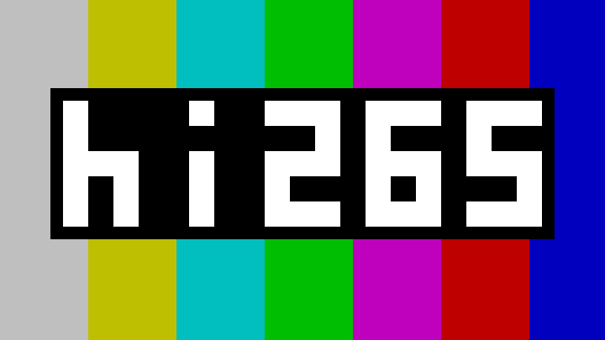

[](https://coveralls.io/github/Eyevinn/hi265?branch=main)
[](https://pkg.go.dev/github.com/Eyevinn/hi265)
[](https://github.com/Eyevinn/hi265/blob/main/LICENSE)
[](https://app.osaas.io/browse/eyevinn-mp4ff)

## Pure Go HEVC/H.265 Decoder & Bitstream Generator

A pure Go HEVC/H.265 decoder for intra pictures (IDR and CRA) and P-skip
frames, plus a bitstream generator for producing valid HEVC test content from
flat-color 16x16 CTU patterns. Sister project to
[hi264](https://github.com/Eyevinn/hi264) (H.264/AVC).

This is **not** a general-purpose video encoder — it does not accept arbitrary
pixel input or perform motion estimation. The encoder produces intra DC
prediction frames where each CTU is a single flat color, defined by a grid
pattern. This is useful for generating test bitstreams, color bars, frame
counters, and reference content for decoder verification.

Decoding is 8-bit 4:2:0 only. The gray IDR generator (`hi265gray`) supports
any chroma format and bit depth (4:2:0, 4:2:2, 4:4:4; 8-bit, 10-bit, 12-bit).

Pixel-perfect against FFmpeg in both directions. Intra pictures from a real
encoder decode bit-exactly — wavefront parallel processing (x265's default),
SAO, deblocking, sign data hiding, every intra mode, NxN partitions, transform
trees from 4x4 to 32x32, per-quantization-group QP and the conformance window —
verified across 48 x265 configurations. Everything the generator produces
decodes identically in FFmpeg and in this decoder, which is checked on every
`go test` run. See [Build & Test](#build--test).

The generator emits both parallelism tools as well. Tiles — `hi265gen -tiles
2x2`, and any of the external-parameter-set encoders when the PPS enables them —
become one independent slice segment per tile with no filtering across the
boundaries. Wavefront parallel processing — `hi265gen -wpp`, or any PPS with
`entropy_coding_sync_enabled_flag` set, which is what x265 writes by default —
keeps the picture one slice segment and makes each CTU row its own CABAC
substream, reached through an entry point offset, with the row's contexts taken
from the row above. That is what lets `hi265gray` and `hi265-mp4-extend` splice a
refresh or a freeze into a default-settings x265 stream. Tiles decode
bit-exactly too, in both shapes a real encoder emits: one slice
segment per tile, which is what a tile-stitching tool produces, and every tile in
a single segment reached through entry point offsets, which is what
`kvazaar --tiles` does by default. Loop filters are included — neither
deblocking nor SAO reaches across a tile boundary when the PPS forbids it, and
the per-slice deblocking parameters are honoured. Multi-slice pictures decode in
both segment shapes as well: independent slices, each with their own wavefront
substreams, and dependent segments that continue the slice before them. Tiles
combined with wavefront parallel processing is refused with a clear error rather
than mis-decoded, encoding and decoding alike — no HEVC profile permits it.

Not supported: P/B frames with real motion. Only zero-motion skip CUs are
reconstructed, so inter pictures beyond a freeze are out of scope — and such a
stream is refused with a message naming the CU that stopped it, rather than
decoded into a plausible-looking wrong picture.

## Build & Test

```bash
go build ./...
go test ./...
```

Most tests are self-contained. Two groups compare against external tools and
**skip cleanly when those are missing**, so a bare `go test ./...` always passes:

| test | needs | what it proves |
|---|---|---|
| `TestGeneratorConformance` | ffmpeg | every generated stream decodes identically in FFmpeg and in `pkg/decoder`, and both match the intended pattern |
| `TestDecodeRealContent` | ffmpeg + x265 | 48 x265 configurations decode bit-exactly |
| `TestDecodeWPPStreams` | ffmpeg + x265 | wavefront parallel processing, including x265's own defaults |
| `TestGeneratedWppAgainstFFmpeg` | ffmpeg | generated wavefront streams are byte-exactly right, which a round trip through `pkg/decoder` cannot show: it navigates by the entry point offsets and so cannot see a wrong byte alignment |
| `TestEncodeIDRWithCuQpDeltaAgainstFFmpeg` | ffmpeg | `cu_qp_delta_abs` is written in the right place with the right binarisation, at both quantization group sizes |
| `TestEncodeIDRWithSignHidingAgainstFFmpeg` | ffmpeg | the hidden `coeff_sign_flag` is omitted in the right place — the half that changes the bin count; the parity itself is pinned by `TestEncodeIDRWithSignHiding` |
| `TestEncodeIDRWithChromaQPOffsetsAgainstFFmpeg` | ffmpeg | chroma scales at the QP `pps_cb_qp_offset`/`pps_cr_qp_offset` imply; the encoder-only half is pinned by `TestEncodeIDRWithChromaQPOffsets`, which has the opposite blind spot |
| `TestDeblockExactness` | ffmpeg + x265 | the loop filter is bit-exact, isolated on content that is exact without it |

Point them at specific binaries with `HI265_FFMPEG` and `HI265_X265` if the ones
on `PATH` are not the ones you want. The golden decoder tests in `pkg/decoder`
need neither tool: their reference YUVs are committed under `testdata/golden/`.

## CLI Tools

### hi265dec — Decode HEVC to raw frames or images

Input is Annex-B (`.265`, `.hevc`, `.h265`) or MP4 (`.mp4`, `.m4v`, `.m4s`),
progressive or fragmented; MP4 parameter sets are read from the `hvcC` box.
Output format follows the output extension: `.yuv`, `.y4m`, `.png`, `.jpg`.
The output path may be given positionally or with `-o`, and flags may appear on
either side of the input path.

```bash
# Raw YUV (all decoded frames, concatenated)
go run ./cmd/hi265dec input.265 output.yuv
go run ./cmd/hi265dec input.265 -o output.yuv

# MP4 input; samples decode in order, so P-skip frames resolve correctly
go run ./cmd/hi265dec input.mp4 -o frames.yuv

# Thumbnail: first frame only
go run ./cmd/hi265dec -n 1 input.mp4 thumb.png

# N frames as numbered images (thumbs_0000.jpg, thumbs_0001.jpg, ...)
go run ./cmd/hi265dec -n 5 -q 95 input.mp4 thumbs.jpg

# Y4M, and a BT.709 RGB conversion for the image formats
go run ./cmd/hi265dec input.265 out.y4m
go run ./cmd/hi265dec -colorspace bt709 input.265 out.png
```

| Flag | Description | Default |
|---|---|---|
| `-o` | Output file (or give it as the second positional) | input name + `.yuv` |
| `-n` | Number of frames to write (0 = all) | 0 |
| `-q` | JPEG quality (1-100) | 85 |
| `-colorspace` | Color space for RGB conversion (`bt601`/`bt709`/`bt2020`) | `bt601` |
| `-full-range` | Treat input as full-range YCbCr | off |

> **What is refused, not guessed at.** Bit depth other than 8, chroma formats
> other than 4:2:0, PCM, transquant bypass (lossless), explicit
> `scaling_list_data`, the range extension residual tools, and inter pictures with
> real motion all produce a clear error naming the tool. Scaling lists themselves
> are supported for the default matrices. The rule is that a stream either decodes
> correctly or says why not — a subtly wrong picture is the one outcome worth
> avoiding.
>
> Real encoder output decodes bit-exactly: wavefront parallel processing
> (x265's default), SAO, deblocking, sign data hiding, every intra mode, NxN
> partitions, transform trees down to 4x4, 32x32 transforms, per-quantization-
> group QP, and the SPS conformance window. Verified against FFmpeg across 60
> x265 configurations. Tiles decode exactly as well, in both slice shapes and
> with both loop filters. Not supported: P/B frames with real
> motion — only zero-motion skip is implemented, so inter pictures beyond a
> freeze are out of scope and are refused rather than mis-decoded.

### hi265-mp4-extend — Extend a CMAF segment with empty frames

Appends N frames to a fragmented MP4 media segment, reusing the source's SPS
and PPS verbatim so the output splices with no parameter-set change. Useful for
padding a segment out to a target duration.

```bash
# Freeze: append 25 P-skip copies of the segment's last picture
go run ./cmd/hi265-mp4-extend -frames 25 init.mp4 in.m4s out.m4s

# Refresh with a mid-gray CRA, then P-skip copies of it. A CRA carries
# slice_pic_order_cnt_lsb, so it continues the source POC instead of resetting
# it — the right choice for splicing into a running stream, and something
# H.264 cannot express.
go run ./cmd/hi265-mp4-extend -frames 25 -gray-cra init.mp4 in.m4s out.m4s

# Or a gray IDR (resets POC to 0 for everything after it)
go run ./cmd/hi265-mp4-extend -frames 25 -gray-idr init.mp4 in.m4s out.m4s

# Attach a Time Code SEI to each appended frame, continuing from the source
go run ./cmd/hi265-mp4-extend -frames 25 -timecode init.mp4 in.m4s out.m4s

# The result is a self-contained media segment, played next to the init segment
cat init.mp4 out.m4s | ffplay -i -
```

### hi265gen — HEVC bitstream generator for test content

Generates valid HEVC/H.265 bitstreams from grid-based patterns. Each character
in a grid maps to one 16x16 CTU filled with a single flat color, encoded as
intra with DC prediction. This is not a general-purpose encoder — it produces
test content from color patterns, not from arbitrary video frames.

Output formats:

| Extension | Format | Notes |
|---|---|---|
| `.265`/`.hevc` | Annex-B | Raw HEVC bitstream |
| `.mp4` | Fragmented MP4 | fMP4/CMAF with configurable fps and fragment duration |
| `.y4m` | Y4M | YUV4MPEG2 container |
| `.yuv` | Raw YUV | 4:2:0 planar |
| `.png` | PNG | Raw grid output (no HEVC encoding) |
| `.jpg` | JPEG | Raw grid output (`-q` for quality, default 85) |

Multi-frame sequences use P-skip frames
between IDR keyframes to copy the reference frame unchanged. Image formats
(YUV, Y4M, PNG, JPEG) output the grid pattern directly without HEVC encoding,
useful as reference images for decoder verification.

The grid and color systems are shared with
[hi264](https://github.com/Eyevinn/hi264) via its `pkg/yuv` package, so the
same `.gridimg` files and color specs work with both tools.

```bash
# Grid-only: single IDR frame from grid pattern (frame size = grid size)
go run ./cmd/hi265gen -gi examples/logo.gridimg -o logo.265
go run ./cmd/hi265gen -gp "xy,yx" -gc x=235,128,128 -gc y=16,128,128 -o checker.265
go run ./cmd/hi265gen -gp "ab" -gc a=255,0,0 -gc b=0,0,255 -rgb -qp 20 -o test.265

# Counter: frame counter digits on solid background
go run ./cmd/hi265gen -w 192 -h 96 -n 10 -text "%03d" -o counter.265

# With P-skip frames (IDR every 50 frames, P-skip copies between)
go run ./cmd/hi265gen -w 192 -h 96 -n 100 -text "%03d" -idr-interval 50 -o counter.265

# Fragmented MP4 output (25 fps default, fragment every 25 frames)
go run ./cmd/hi265gen -w 192 -h 96 -n 50 -text "%03d" -o counter.mp4

# MP4 with custom framerate and fragment duration
go run ./cmd/hi265gen -w 320 -h 240 -n 75 -text "%03d" -fps 30 -frag-dur 30 -o counter.mp4

# Tiled: grid pattern tiled to fill custom dimensions, with optional counter
go run ./cmd/hi265gen -gp "xy,yx" -gc x=235,128,128 -gc y=16,128,128 -w 192 -h 96 -n 10 -text "%03d" -o counter.265

# SMPTE color bars with counter overlay
go run ./cmd/hi265gen -smpte -w 192 -h 96 -n 10 -text "%03d" -o smpte.265

# SMPTE bars with digit background box and explicit scale
go run ./cmd/hi265gen -smpte -w 352 -h 288 -n 1 -text "%02d" -text-scale 3 -text-bg 0,0,0 -o smpte_big.265

# 8x8 coding granularity: minCb=8, so each 16x16 CTU is split into four
# independent 8x8 CUs, each with its own intra mode. Finer coding structure for
# the same pattern; the grid still maps one character per 16x16 block.
go run ./cmd/hi265gen -gp "xy,yx" -gc x=235,128,128 -gc y=16,128,128 -w 64 -h 64 -8x8 -o fine.265

# Fixed bytes per picture (pad with HEVC filler NALUs for CBR-like streams)
go run ./cmd/hi265gen -smpte -w 192 -h 96 -bpp 5000 -o padded.265
go run ./cmd/hi265gen -w 320 -h 240 -n 50 -text "%03d" -bpp 8000 -o cbr_counter.mp4

# Raw image output (no HEVC encoding, useful as decoder reference)
go run ./cmd/hi265gen -gi examples/logo.gridimg -o logo.png
go run ./cmd/hi265gen -gi examples/logo.gridimg -o logo.yuv
go run ./cmd/hi265gen -gi examples/logo.gridimg -q 95 -o logo.jpg
go run ./cmd/hi265gen -w 192 -h 96 -n 5 -text "%03d" -o output.y4m
go run ./cmd/hi265gen -w 192 -h 96 -n 5 -text "%03d" -o frame_%03d.png
```

```bash
# Time Code SEI: embed an HH:MM:SS:FF timecode per picture (IDR and P-skip alike).
# HEVC carries the timecode in SEI 136, not in pic_timing as H.264 does, so no
# SPS/VUI change is needed. Verify with `mp4ff-nallister -annexb -c hevc -sei 1`.
go run ./cmd/hi265gen -smpte -w 192 -h 96 -n 75 -fps 25 -timecode -o timecode.265

# Read the timecode back with ffprobe (SMPTE 12M side data):
#   ffprobe -loglevel error -select_streams v:0 \
#     -show_entries frame_tags=timecode -of default=nw=1:nk=1 timecode.265

# Start the counter/timecode at a given frame, so independently generated
# segments (-start-frame 0, 48, 96, ...) concatenate into one continuous run.
go run ./cmd/hi265gen -smpte -w 192 -h 96 -n 48 -fps 25 -timecode -start-frame 76 -o seg.265

# Fractional frame rate (29.97 = 30000/1001): MP4 timescale 30000, sample duration 1001.
go run ./cmd/hi265gen -smpte -w 192 -h 96 -n 60 -fps 30000/1001 -timecode -o ntsc.mp4

# NTSC drop-frame counting (valid only for 29.97/59.94).
go run ./cmd/hi265gen -smpte -w 192 -h 96 -n 60 -fps 29.97 -drop-frame -timecode -o df.265
```

```bash
# Color space: generate BT.709 stream (VUI signaled in SPS)
go run ./cmd/hi265gen -gi examples/logo.gridimg -colorspace bt709 -o logo_709.265

# Full-range BT.709
go run ./cmd/hi265gen -smpte -w 320 -h 240 -colorspace bt709 -full-range -o smpte_709.265
```

Flags:

| Flag | Description | Default |
|---|---|---|
| `-gi` | Grid image file (`.gridimg`) | — |
| `-gp` | Inline grid pattern, rows separated by commas (e.g. `"xy,yx"`) | — |
| `-gc` | Color spec (repeatable, e.g. `x=235,128,128`) | — |
| `-rgb` | Treat `-gc` values as RGB instead of YCbCr | off |
| `-smpte` | Use built-in 75% SMPTE color bars pattern | off |
| `-f` | Output format (`265`, `hevc`, `mp4`, `y4m`, `yuv`, `png`, `jpg`); required with `-o -` | from `-o` extension |
| `-w` | Frame width in pixels (multiple of 8) | grid width |
| `-h` | Frame height in pixels (multiple of 8) | grid height |
| `-n` | Number of frames | 1 |
| `-text` | Text overlay pattern (e.g. `"%03d"`, `"%mm:%ss.%ff"`) | — |
| `-text-scale` | Text scale factor (0 = auto-fit) | 0 |
| `-text-bg` | Text background box color (R,G,B) | none |
| `-fg` | Foreground RGB color for text | `255,255,255` |
| `-bg` | Background RGB color | `0,0,0` |
| `-8x8` | Split each 16x16 CTU into four independent 8x8 CUs | off |
| `-tiles` | Uniform `CxR` tile grid, one independent slice segment per tile, no loop filter across the boundaries | off |
| `-wpp` | Wavefront parallel processing: one CABAC substream per CTU row (cannot be combined with `-tiles`) | off |
| `-qp` | Quantization parameter (0-51) | 26 |
| `-q` | JPEG quality (1-100) | 85 |
| `-idr-interval` | Frames between IDR keyframes (0 = all-IDR) | 0 |
| `-bpp` | Target bytes per picture (filler NAL padding) | 0 (off) |
| `-kbps` | Target bitrate in kbit/s (converted to `-bpp` using `-fps`) | 0 (off) |
| `-colorspace` | Color space (`bt601`/`bt709`/`bt2020`) | `bt601` |
| `-full-range` | Full-range YCbCr (0-255) | off (limited) |
| `-timecode` | Emit a Time Code SEI (payload type 136) per picture (`265`/`mp4` only) | off |
| `-start-frame` | Starting frame number; offsets counters, timecodes and the MP4 timeline | 0 |
| `-drop-frame` | NTSC drop-frame timecode counting (only with `-fps 29.97`/`59.94`) | off |
| `-fps` | Framerate: integer (`25`), rational (`30000/1001`) or NTSC decimal (`29.97`) | 25 |
| `-frag-dur` | MP4 fragment duration in frames | 25 |
| `-o` | Output file (`-` for stdout, requires `-f`) | — |
| `-version` | Print version | — |

> **Dimension constraint.** Frame width and height must be multiples of 8.
> Sizes that are not a multiple of the 16x16 CTU — 1920x1080 and 640x360 among
> them — are fully supported: the picture uses an 8-sample minimum coding block
> and the partial CTU row or column is split implicitly, as the spec requires.
> That holds for a ragged *width* as well as a ragged height: since a grid cell is
> one CTU, the pattern is laid out wider than such a picture and the source samples
> are repacked at the picture's own stride before being coded, so the `.265` and
> the `.yuv` of one pattern describe the same picture.
> Sizes that are not a multiple of 8 cannot be expressed with a 16x16 CTU
> without a conformance window, and are rejected with an error naming the
> nearest usable size.

### Constant bitrate testing with `-bpp`

The `-bpp` flag pads each picture to an exact byte count using HEVC filler data
NAL units (NAL type 38). This is useful for testing bitrate-sensitive scenarios
such as ABR ladder switching, buffer management, and segment size constraints.

The target bitrate in kbit/s is: `bpp * 8 * fps / 1000`. For example, `-bpp 5000`
at 25 fps gives 1000 kbit/s. An error is returned if a frame's encoded slice
already exceeds the target (use a higher QP or larger `-bpp` value).

A practical pattern is to use different background colors or patterns for
different bitrate tiers so the current quality level is visually obvious during
playback:

```bash
# 500 kbit/s tier — green background
go run ./cmd/hi265gen -w 320 -h 240 -n 50 -text "%03d" -bg 0,128,0 -bpp 2500 -o low.mp4

# 1500 kbit/s tier — blue background
go run ./cmd/hi265gen -w 640 -h 360 -n 50 -text "%03d" -bg 0,0,200 -bpp 7500 -o mid.mp4

# 3000 kbit/s tier — red background
go run ./cmd/hi265gen -w 1280 -h 720 -n 50 -text "%03d" -bg 200,0,0 -bpp 15000 -o high.mp4
```

This makes it easy to verify that an ABR player switches between the correct
renditions — you can tell which bitrate tier is active just by looking at the
background color.

## Image File Format

The `.gridimg` format combines color definitions and a grid layout in one file.
This format is shared with [hi264](https://github.com/Eyevinn/hi264) — the same
files work with both `hi264gen` and `hi265gen`.

```
# Comments start with #
@rgb
@bt709
# Colors: char=v1,v2,v3 (YCbCr by default, RGB with @rgb directive or -rgb flag)
B=0,106,167
Y=254,204,0

BBBBBYYBBBBBBBBB
BBBBBYYBBBBBBBBB
YYYYYYYYYYYYYYYY
YYYYYYYYYYYYYYYY
BBBBBYYBBBBBBBBB
BBBBBYYBBBBBBBBB
```

Each character in the grid maps to one 16x16 CTU. Supported directives:
`@rgb` (treat values as RGB), `@bt601`/`@bt709`/`@bt2020` (color space for
RGB-to-YCbCr conversion). See `examples/` for complete examples.

## Example Patterns

The `examples/` directory contains `.gridimg` files:

| File | Description | Size (CTUs) |
|---|---|---|
| `logo.gridimg` | hi265 logo: SMPTE bars with text | 48x27 |

```bash
# Encode to HEVC
go run ./cmd/hi265gen -gi examples/logo.gridimg -o logo.265

# Decode to raw YUV
go run ./cmd/hi265dec logo.265 logo.yuv

# Generate reference PNG for comparison (raw output, no HEVC)
go run ./cmd/hi265gen -gi examples/logo.gridimg -o expected.png

# Cross-verify with FFmpeg (raw YUV)
go run ./cmd/hi265dec logo.265 logo.yuv
ffmpeg -i logo.265 -pix_fmt yuv420p -f rawvideo ff.yuv
cmp logo.yuv ff.yuv  # should be identical
```

### hi265gray — Gray IDR/CRA frame generator for GDR streams

Generates a uniform mid-gray IDR or CRA frame given external VPS, SPS, and PPS
parameter sets. Intended for bootstrapping decoders in Gradual Decode Refresh
(GDR) streams that lack IDR frames.

The gray frame uses DC prediction with zero residual, making it independent of
chroma format and bit depth — it works with 4:2:0, 4:2:2, 4:4:4 at any bit
depth. Each CTU is encoded as the largest possible CU (no quadtree splitting),
producing compact bitstreams (~344 bytes for 1920x1080 with wavefront parallel
processing on, against x265's 610 for the same picture).
The output is an Annex-B bitstream containing VPS + SPS + PPS + IDR slice.

```bash
# From a JSON parameter set file (extracts first VPS/SPS/PPS)
go run ./cmd/hi265gray -f params.json -o gray.265

# From hex strings
go run ./cmd/hi265gray -vps 40010c... -sps 4201... -pps 4401... -o gray.265

# A CRA refresh frame (nal_unit_type 21) at a chosen picture order count
go run ./cmd/hi265gray -f params.json -cra -poc 42 -o gray_cra.265
```

With `-cra` the slice is a CRA (Clean Random Access) picture at the POC given by
`-poc` instead of an IDR. A CRA derives its POC MSBs from the preceding pictures
rather than resetting the POC to 0, so it can be spliced into a running stream as
a refresh point without breaking POC continuity of the pictures that follow —
which an IDR cannot do.

The input file (`-f`) is a JSON object with `vps`, `sps`, and `pps` hex strings:

```json
{"vps": "40010c01ffff...", "sps": "4201012408...", "pps": "4401c0764c..."}
```

Test parameter sets are included in `cmd/hi265gray/testdata/`:

| File | Format | Notes |
|---|---|---|
| `vps_sps_pps_420_8bit.json` | 4:2:0 8-bit | 128x64, CTU=64 |
| `vps_sps_pps_420_10bit.json` | 4:2:0 10-bit | 1920x1080, CTU=64 |
| `vps_sps_pps_422_10bit.json` | 4:2:2 10-bit | 1920x1080, CTU=64 |
| `vps_sps_pps_420_8bit_wpp.json` | 4:2:0 8-bit | 1280x720, CTU=64, x265 defaults so wavefront parallel processing is on |

### hi265retile — Stitch HEVC streams as tiles

Combines several HEVC videos into one picture by treating each as a **tile**,
editing only the bitstream. The CABAC slice payloads are copied **verbatim**,
never re-encoded, so the merged picture carries exactly the samples the inputs
carried, at exactly their bitrate. Works for all-intra streams and for
motion-constrained (MCTS) P/B-frame streams, in arbitrary tile grids.

```
vertical 2x1            2x2 grid              horizontal 1x3
┌──────────┐         ┌─────┬─────┐         ┌────┬────┬────┐
│  tile 0  │         │  0  │  1  │         │ 0  │ 1  │ 2  │
├──────────┤         ├─────┼─────┤         └────┴────┴────┘
│  tile 1  │         │  2  │  3  │
└──────────┘         └─────┴─────┘
```

```bash
# Vertical Nx1 stack (the default), and an explicit row-major grid
go run ./cmd/hi265retile -o merged.265 top.265 bottom.265
go run ./cmd/hi265retile -grid 2x2 -o merged.265 a.265 b.265 c.265 d.265

# Also check the result: decode it and compare every tile to its own decode
go run ./cmd/hi265retile -verify -o merged.265 top.265 bottom.265

# Pick the verification decoder explicitly (default: auto)
go run ./cmd/hi265retile -verify -decoder ffmpeg -o merged.265 top.265 bottom.265

# Generate a tile-ready input, and see what a stream actually contains
tools/gen_retile_inputs.sh /tmp/tiles a 512x256 intra "testsrc2=size=512x256:rate=5"
go run ./cmd/hi265inspect merged.265
```

`-grid RxC` arranges the inputs in `R` tile rows by `C` tile columns in
row-major order. Tiles in a column must share a width and tiles in a row a
height, but the grid need not be uniform — unequal column widths and row
heights are emitted as explicit `column_width_minus1` / `row_height_minus1`.

Only geometry and tiling are rewritten. The SPS gets the merged
`pic_width/height_in_luma_samples` and a `general_level_idc` raised to cover the
larger picture; the PPS gets `tiles_enabled_flag = 1`, the tile grid, and
`loop_filter_across_tiles_enabled_flag = 0`; each input slice becomes one tile's
slice, with a re-emitted `first_slice_segment_in_pic_flag`, a
`slice_segment_address` pointing at the tile's first CTB, and a trailing
`num_entry_point_offsets = 0`. Everything else in the slice header — slice_type,
POC, reference picture sets, reference lists, QP — is copied verbatim, which is
why I, P and B slices all work without reimplementing any of it.

The payloads stay valid because with tiles enabled and filtering disabled across
tile boundaries a tile's edges behave like picture edges, which is exactly how
each standalone video already treated its own edges.

#### Verifying a stitch

`-verify` decodes the merged stream and each input, then compares every tile's
sub-rectangle against its standalone decode across all frames. This is the
empirical proof that the inputs really were tileable — in particular of the MCTS
property, which is not visible anywhere in the bitstream.

```
verify OK  tile @0,0 512x256 == top.265 (5 frames, hi265)
verify OK  tile @0,256 512x256 == bottom.265 (5 frames, hi265)
verify: all tiles pixel-perfect
```

`-decoder` chooses what does the decoding:

| value | behaviour |
|---|---|
| `auto` (default) | `pkg/decoder` in-process, falling back to ffmpeg for a stream it cannot decode |
| `hi265` | `pkg/decoder` in-process only. No external binary, so this runs anywhere |
| `ffmpeg` | ffmpeg only. The cross-check that would catch a bug shared by the stitcher and `pkg/decoder` |

A stitch of inter pictures is the one case `pkg/decoder` cannot check, since it
reconstructs only zero-motion skip CUs; `auto` uses ffmpeg for it, and `hi265`
fails with a message naming the limitation rather than reporting a pass nobody
made. Feeding P-frames that are *not* motion-constrained fails where motion
crosses a tile seam:

```
error: MISMATCH tile @0,0 512x256 (na.265) at frame 3
```

`tools/retile_demo.sh` runs the whole thing end to end: it generates inputs with
ffmpeg, x265 and kvazaar, stitches them under four geometries, verifies each,
and finishes with a non-MCTS stitch that verification must reject.

#### What the inputs must satisfy

All tiles share one SPS and one PPS, so the inputs must agree on everything that
affects how `slice_segment_data` is parsed and reconstructed. Each of these is
checked and refused with a message naming the offending property:

- **Same coding tools** — chroma format, bit depth, CTB/CB/TB sizes, max
  transform depth, scaling lists, SAO, AMP, PCM, `sps_temporal_mvp`,
  `sign_data_hiding`, `cu_qp_delta`, transform skip, the chroma QP offsets, the
  range and SCC extensions. Only the picture size and the level may differ.
  `init_qp_minus26` is on this list because a slice QP is coded as a delta from
  it and those bits are copied verbatim — but the per-slice QP itself may
  differ, so tiles can be at different quality.
- **CTB-aligned** — each input's width and height a multiple of the shared CTB
  size, tiles in a column sharing a width and tiles in a row a height.
- **One picture per slice segment**, tiles and WPP off, no
  slice-segment-header extension, so no slice carries entry point offsets and
  the bit-splice is exact.
- **No conformance window** — the merged SPS applies one window to the whole
  picture rather than one per tile. Crop before stitching.
- **Aligned GOP** — the same picture index in every input shares its POC and its
  NAL type.

The one condition that cannot be checked from the bitstream is that inter inputs
are **motion-constrained**, so that motion vectors and their interpolation
footprint never reference samples outside the tile. That is what `-verify` is
for. SEI, AUD and filler NAL units are not carried into the merged stream, since
the merged picture is not the picture they describe.

### hi265inspect — Dump the NAL structure of a stream

Prints every NAL unit of an Annex-B file with the SPS, PPS and slice-header
fields that decide whether streams can be stitched or how a picture is coded.

```bash
go run ./cmd/hi265inspect input.265
```

## Library Usage

The `pkg/` packages provide a public API for use as a Go library. Implementation
details are in `internal/` and not accessible to external callers.

```go
import (
    "github.com/Eyevinn/hi265/pkg/decoder"
    "github.com/Eyevinn/hi265/pkg/encode"
    "github.com/Eyevinn/hi265/pkg/timecode"
    "github.com/Eyevinn/hi264/pkg/yuv"
)

// Decode an Annex-B byte stream (e.g. .265 file contents)
dec := decoder.New()
frames, err := dec.DecodeAnnexB(data)

// Generate HEVC from grid pattern (each cell = one 16x16 CTU)
grid, _ := yuv.ParseGrid("AB,CD")
colors := yuv.ColorMap{'A': yuv.Color{16, 128, 128}, 'B': yuv.Color{128, 128, 128}}
p := encode.EncodeParams{Width: 32, Height: 32, QP: 26}
vpsSPSPPS, _ := encode.GenerateVPSSPSPPS(p)
idrSlice, _ := encode.GenerateIDR(p, grid, colors)
annexB := append(vpsSPSPPS, idrSlice...)

// Generate a P-skip frame (copies IDR content unchanged)
pSkip, _ := encode.GeneratePSkip(p, 1)
annexB = append(annexB, pSkip...)

// Encode IDR and P-skip slices compatible with external SPS/PPS
// (e.g., parameter sets from an MP4 sample description or third-party encoder).
// Tiles, wavefront parallel processing and cu_qp_delta in the PPS are all
// honoured; see the note below for what is not.
sps, _ := hevc.ParseSPSNALUnit(spsNALU)
pps, _ := hevc.ParsePPSNALUnit(ppsNALU, spsMap)
idrSlice, err := encode.EncodeIDRSliceFromSPSPPS(sps, pps, grid, colors)
pSkipSlice, err := encode.EncodePSkipSliceFromSPSPPS(sps, pps, poc)

// Generate a gray IDR frame from external SPS/PPS (any chroma format / bit depth)
// Useful for bootstrapping GDR streams that lack IDR frames.
grayIDR, err := encode.EncodeGrayIDRSliceFromSPSPPS(sps, pps)

// CRA (Clean Random Access) refresh point at a chosen POC. Unlike an IDR, a CRA
// does not reset the POC, so it splices into a running stream without breaking
// POC continuity of the pictures that follow.
craSlice, err := encode.EncodeCRASliceFromSPSPPS(sps, pps, grid, colors, poc)
grayCRA, err := encode.EncodeGrayCRASliceFromSPSPPS(sps, pps, poc)

// Extend an existing stream: read the tail state, then append empty frames that
// continue its POC. The source SPS/PPS are reused, so nothing is re-emitted.
state, err := encode.LastFrameState(annexB)   // POC, NAL unit type, active SPS/PPS
extended, err := encode.AppendEmptyFrames(annexB, 25)
```

> **What an external PPS may ask for.** `tiles_enabled_flag` (one slice segment
> per tile), `entropy_coding_sync_enabled_flag` (one CABAC substream per CTB row)
> and `cu_qp_delta_enabled_flag` (a zero delta at the first coefficient-carrying
> transform unit of each quantization group) are all written correctly, and tiles
> combined with wavefront processing is refused since no profile permits it.
> `sign_data_hiding_enabled_flag` (x265's default: the sign of a sub-block's
> lowest-frequency significant coefficient carried by the parity of its levels) is
> written correctly as well, and `weighted_pred_flag` is refused. Still **ignored
> rather than refused** by the grid IDR/CRA writer: nothing, as of the chroma QP
> offset work — `pps_cb_qp_offset` and `pps_cr_qp_offset` are applied, and
> `chroma_qp_offset_list_enabled_flag`, the per-CU variant, is refused because it
> needs transform-unit syntax this encoder does not write.

```go
// Time Code SEI (payload type 136). HEVC carries the SMPTE timecode here rather
// than in pic_timing, so no SPS/VUI change is needed to attach one.
h, m, sec, fr, _ := timecode.Components(frameNum, 25, false)
sei, err := encode.GenerateTimeCodeSEI(encode.TimeCode{
    Hours: uint8(h), Minutes: uint8(m), Seconds: uint8(sec), Frames: uint16(fr),
})
```

### Appending frames to an existing bitstream

This example parses VPS/SPS/PPS from an existing HEVC bitstream, then appends
a black IDR frame and a P-skip frame that are compatible with the original
parameter sets:

```go
import (
    "github.com/Eyevinn/hi264/pkg/yuv"
    "github.com/Eyevinn/hi265/pkg/encode"
    "github.com/Eyevinn/mp4ff/avc"
    "github.com/Eyevinn/mp4ff/hevc"
)

// Parse parameter sets from the existing bitstream
nalus := avc.ExtractNalusFromByteStream(existingStream)
spsMap := make(map[uint32]*hevc.SPS)
var sps *hevc.SPS
var pps *hevc.PPS
for _, nalu := range nalus {
    if len(nalu) < 2 {
        continue
    }
    switch hevc.GetNaluType(nalu[0]) {
    case hevc.NALU_SPS:
        sps, _ = hevc.ParseSPSNALUnit(nalu)
        spsMap[uint32(sps.SpsID)] = sps
    case hevc.NALU_PPS:
        pps, _ = hevc.ParsePPSNALUnit(nalu, spsMap)
    }
}

// Create a black grid matching the SPS dimensions (each cell = one 16x16 CTU)
w := int(sps.PicWidthInLumaSamples)
h := int(sps.PicHeightInLumaSamples)
blackY := uint8(16)  // limited range black
if sps.VUI != nil && sps.VUI.VideoFullRangeFlag {
    blackY = 0       // full range black
}
grid, colors := yuv.SolidGrid(w, h, yuv.Color{blackY, 128, 128})

// Encode a black IDR slice using the existing parameter sets
idrSlice, _ := encode.EncodeIDRSliceFromSPSPPS(sps, pps, grid, colors)

// Encode a P-skip slice (copies the IDR frame unchanged)
pSkipSlice, _ := encode.EncodePSkipSliceFromSPSPPS(sps, pps, 2) // POC=2

// Append to the original stream
stream := append(existingStream, idrSlice...)
stream = append(stream, pSkipSlice...)
```

## Architecture

```
pkg/decoder/          — Public: top-level decoder API (DecodeAnnexB, DecodeNALUs)
pkg/encode/           — Public: bitstream generator API (GenerateIDR, GeneratePSkip,
                        CRA and gray slices from external SPS/PPS, Time Code SEI,
                        stream extension, FrameEncoder)
pkg/retile/           — Public: stitch N streams into one tiled picture, and verify the result
pkg/frame/            — Public: Frame type (decoded output)
pkg/timecode/         — Public: SMPTE timecode arithmetic and text formatting
internal/cabac/       — Internal: CABAC arithmetic decoder and encoder engines
internal/context/     — Internal: Context model initialization (170 contexts)
internal/slice/       — Internal: Slice data parsing, CTU/CU/TU quadtree, WPP substreams
internal/transform/   — Internal: Inverse quantization and transform (4x4 to 32x32, DST-VII)
internal/pred/        — Internal: Intra prediction modes (planar, DC, angular)
internal/deblock/     — Internal: Deblocking filter
internal/sao/         — Internal: Sample Adaptive Offset
cmd/hi265dec/         — CLI: decode HEVC from Annex-B or MP4 to YUV/Y4M/PNG/JPEG
cmd/hi265gen/         — CLI: generate HEVC bitstreams or raw images from grid patterns
cmd/hi265gray/        — CLI: generate gray IDR/CRA frames from external VPS/SPS/PPS
cmd/hi265-mp4-extend/ — CLI: extend a CMAF media segment with empty frames
cmd/hi265retile/      — CLI: stitch several Annex-B streams into one tiled stream
cmd/hi265inspect/     — CLI: dump VPS/SPS/PPS/slice-header fields of an Annex-B file
examples/             — Example grid image files
tools/                — Test generation scripts
testdata/             — Golden HEVC bitstreams for regression testing
```

## Related Projects

- [hi264](https://github.com/Eyevinn/hi264) — Sister project: pure Go H.264/AVC frame decoder & bitstream generator

## Dependencies

- [`github.com/Eyevinn/mp4ff`](https://github.com/Eyevinn/mp4ff) — VPS/SPS/PPS/SliceHeader parsing, MP4 container, HEVC descriptor, fragmented MP4 creation
- [`github.com/Eyevinn/hi264`](https://github.com/Eyevinn/hi264) — Grid/color/SMPTE/counter utilities (`pkg/yuv`), frame type (`pkg/frame`)

## Support

Join our [community on Slack](http://slack.streamingtech.se) where you can post any questions regarding any of our open source projects. Eyevinn's consulting business can also offer you:

* Further development of this component
* Customization and integration of this component into your platform
* Support and maintenance agreement

Contact [sales@eyevinn.se](mailto:sales@eyevinn.se) if you are interested.

## About Eyevinn Technology

[Eyevinn Technology](https://www.eyevinntechnology.se) is an independent consultant firm specialized in video and streaming. Independent in a way that we are not commercially tied to any platform or technology vendor. As our way to innovate and push the industry forward we develop proof-of-concepts and tools. The things we learn and the code we write we share with the industry in [blogs](https://dev.to/video) and by open sourcing the code we have written.

Want to know more about Eyevinn and how it is to work here. Contact us at work@eyevinn.se!
